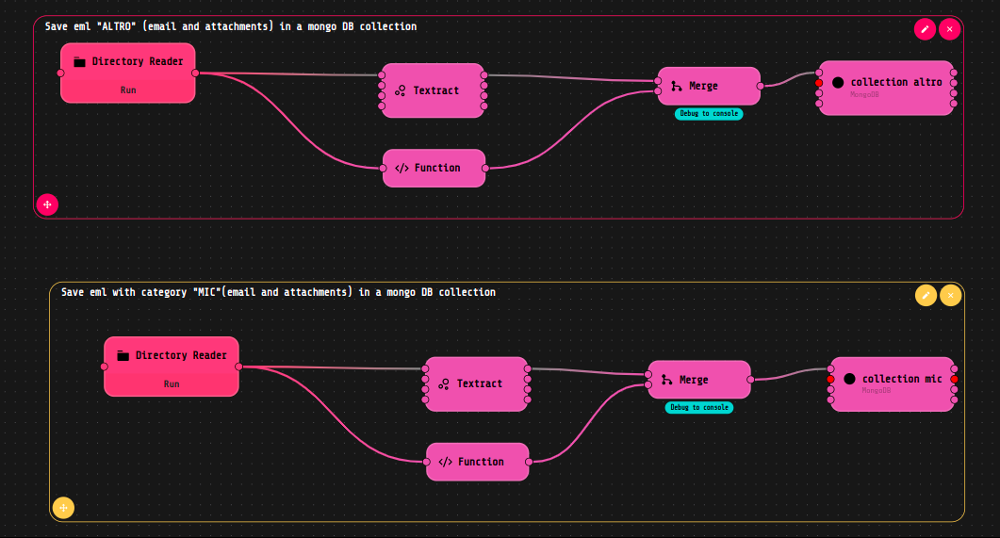

# Eml classification demo

This is a demo of eml classification using the LOKO AI predictor to classify eml files, using previously extracting texts from emails and attachments using Textract component, and saving it in specific collections on MongoDB using the specific LOKO AI component.

## LOKO AI Flow

The above flow takes eml files from a specific folder, extracts the text from the eml files and saves it in a specific collection on MongoDB. There are two categories, and consequently two collections, one for each category.

The LOKO AI predictor is used to train the saved texts in the collections,as shown in the flow below:

